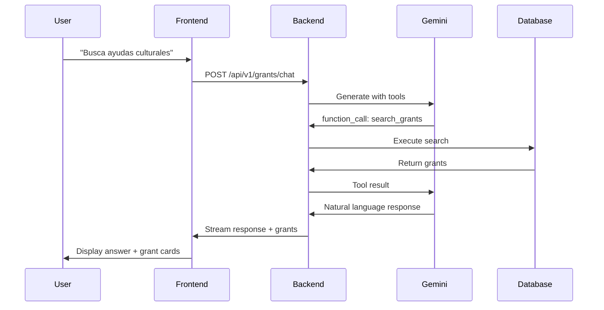

# Grants Chat System - Technical Documentation

**Last Updated**: 2025-12-05
**Status**: 🟡 Active Development - Issues Identified
**System**: RAG-based conversational assistant for Spanish grant discovery

---

## Table of Contents
1. [System Overview](#system-overview)
2. [Architecture](#architecture)
3. [Current Issues](#current-issues)
4. [Desired Functionality](#desired-functionality)
5. [Implementation Details](#implementation-details)
6. [Testing Strategy](#testing-strategy)

---

## System Overview

### Purpose
An AI-powered conversational assistant that helps users:
- 🔍 **Search for grants** using natural language queries
- 📊 **Get detailed information** about specific grants
- 💬 **Have multi-turn conversations** with context retention
- 🎯 **Receive personalized recommendations** based on user needs

### Technology Stack
- **Backend**: Django + Python 3.12
- **LLM**: Google Gemini 2.5-flash with function calling
- **Database**: PostgreSQL with pgvector for semantic search
- **Frontend**: React + TypeScript + WebSocket for streaming
- **RAG Engine**: Custom V2 implementation with tool execution

---

## Architecture

### Backend Components

#### 1. RAG Engine ([rag_engine_v2.py](../ARTISTING-main/backend/apps/grants/services/rag_engine_v2.py))
- **GrantRAGEngineV2**: Main orchestrator
- **Function calling loop**: Gemini decides when to use tools
- **Streaming-first design**: Real-time responses

#### 2. Chat Tools ([chat_tools.py](../ARTISTING-main/backend/apps/grants/services/chat_tools.py))
Three core tools available to the LLM:
- `search_grants(query, filters, limit)`: Semantic + filter-based search
- `get_grant_by_numero(numero_convocatoria)`: Fetch specific grant details
- `list_recent_grants(limit)`: Show recently published grants

#### 3. API Endpoints ([views.py](../ARTISTING-main/backend/apps/grants/views.py))
- `POST /api/v1/grants/chat`: Main chat endpoint
- Handles conversation history via session_id
- Returns: answer, grants, metadata

#### 4. Data Models
- **Convocatoria**: 110+ fields of grant data
- **PDFExtraction**: LLM-extracted structured data from grant PDFs
- **Embedding**: 768-dim vectors for semantic search

### Frontend Components

#### ChatView.tsx
- WebSocket-based real-time communication
- Agent protocol: plan, thought, tool_input, tool_output
- Interactive tool use with input_request capability
- Complex state management for multi-step agent reasoning

---

## Current Issues

### Backend Issues (from Gemini Analysis)

#### 🔴 Critical
None identified yet

#### 🟡 Medium Priority

1. **Broad Error Handling** ([rag_engine_v2.py:132-134](../ARTISTING-main/backend/apps/grants/services/rag_engine_v2.py#L132-L134))
   - Generic `except Exception` catches all errors
   - Doesn't distinguish between API errors (content safety, rate limits) vs code errors
   - Users get generic error messages
   - **Impact**: Poor error visibility, difficult debugging

2. **Simplistic Function Call Parsing** ([rag_engine_v2.py:98-106](../ARTISTING-main/backend/apps/grants/services/rag_engine_v2.py#L98-L106))
   - Assumes function_call is always first part
   - Could miss function calls if model returns multiple parts
   - **Impact**: Tools might not execute when they should

3. **No Recursive Function Calls**
   - Only handles single tool use per turn
   - Cannot chain tools (e.g., search → get details → search related)
   - **Impact**: Limited agent capabilities, requires multiple user messages

#### 🟢 Low Priority

4. **Fixed Function Call in get_grant_by_numero** ✅
   - **Status**: FIXED (2025-12-05)
   - Changed from `convocatoria=grant` to `convocatoria_id=grant.id`
   - Now correctly retrieves PDF extraction data

### Frontend Issues (from Gemini Analysis)

#### 🟡 Medium Priority

5. **High Component Complexity** (ChatView.tsx)
   - Large component with many states
   - Difficult to maintain and debug
   - **Impact**: Bugs in state synchronization, hard to extend

6. **No UI Error Display**
   - WebSocket errors only logged to console
   - Users don't see error messages
   - **Impact**: Silent failures, confused users

7. **State Sync on Reconnect**
   - WebSocket reconnection might lose agent state
   - No explicit re-sync logic
   - **Impact**: Stale UI after network interruption

### User-Reported Issues

#### 🔴 Critical
*(To be filled in as issues are reported)*

#### 🟡 Medium Priority
*(To be filled in as issues are reported)*

#### 🟢 Low Priority
*(To be filled in as issues are reported)*

---

## Desired Functionality

### User Stories

#### Core Functionality
- [ ] **US-1**: As a user, I can search for grants using natural language
  - Example: "ayudas para organizar eventos culturales"
  - Expected: AI returns relevant grants with explanations

- [ ] **US-2**: As a user, I can ask for details about a specific grant
  - Example: "Cuéntame más sobre la subvención 870435"
  - Expected: AI provides detailed information from PDFExtraction

- [ ] **US-3**: As a user, I can have multi-turn conversations
  - Example:
    - User: "Busca ayudas culturales"
    - AI: *returns 5 grants*
    - User: "Cuéntame más sobre la tercera"
  - Expected: AI remembers context and provides details

- [ ] **US-4**: As a user, I see the grants referenced in the conversation
  - Expected: UI shows grant cards alongside AI responses

#### Error Handling
- [ ] **US-5**: As a user, I see clear error messages when something fails
  - Examples:
    - "No se encontraron subvenciones para esos criterios"
    - "Error de conexión. Intenta de nuevo."
    - "Esta búsqueda no está disponible temporalmente"

#### Advanced Features
- [ ] **US-6**: As a user, I can refine searches with filters
  - Example: "Busca en Andalucía" → "Solo las que están abiertas"

- [ ] **US-7**: As a user, I can ask comparative questions
  - Example: "¿Cuál tiene mayor cuantía?"

- [ ] **US-8**: As a user, I can ask for explanations
  - Example: "¿Qué son los gastos subvencionables?"

### Technical Requirements

#### Performance
- [ ] Responses start streaming within 2 seconds
- [ ] Full response completes within 10 seconds
- [ ] Semantic search returns results in < 500ms

#### Reliability
- [ ] 99% uptime during business hours
- [ ] Graceful degradation on API failures
- [ ] Automatic retry on transient errors

#### Observability
- [ ] All errors logged with context
- [ ] User queries tracked for analytics
- [ ] Tool execution monitored

---

## Implementation Details

### System Prompt
```
Eres un experto en subvenciones y ayudas públicas de España.
Ayuda a los usuarios de forma natural y conversacional.

Tienes acceso a herramientas para buscar en la base de datos:
- search_grants(query): Busca subvenciones por texto
- get_grant_by_numero(numero_convocatoria): Obtiene detalles específicos
- list_recent_grants(): Muestra las más recientes

Usa las herramientas cuando necesites información específica de la base de datos.
Para preguntas generales, responde directamente con tu conocimiento.

Sé amigable, profesional y útil.
```

### Conversation Flow



---

## Testing Strategy

### Unit Tests
- [ ] Test each chat tool independently
- [ ] Test error handling in rag_engine_v2
- [ ] Test function call parsing edge cases

### Integration Tests
- [ ] Test complete chat flow end-to-end
- [ ] Test conversation history persistence
- [ ] Test WebSocket streaming

### User Acceptance Tests
- [ ] Test all user stories
- [ ] Test error scenarios
- [ ] Test edge cases (no results, network errors)

### Test Files
- `test_grant_details.py` - Tests get_grant_by_numero ✅
- `test_chat_grant_details.py` - Tests complete chat flow ✅
- *(More to be added)*

---

## Known Good Test Cases

### Test Case 1: Specific Grant Lookup ✅
```python
query = "Tell me more about grant 870435"
# Expected: Detailed information with PDF extraction data
# Status: WORKING (as of 2025-12-05)
```

### Test Case 2: Cultural Event Search
```python
query = "Quiero organizar un baile en la plaza del barrio"
# Expected: Returns cultural activity grants
# Status: To be tested
```

---

## Change Log

### 2025-12-05
- ✅ Fixed `get_grant_by_numero` tool - changed from `convocatoria=grant` to `convocatoria_id=grant.id`
- ✅ Created comprehensive system documentation
- 🔍 Identified 7 issues from Gemini analysis

---

## Next Steps

1. [ ] Add user-reported issues to this document
2. [ ] Prioritize issues by impact
3. [ ] Create fix plan for critical issues
4. [ ] Implement fixes systematically
5. [ ] Add regression tests for each fix
6. [ ] Update this document as system evolves

---

## Questions / Unknowns

- How should recursive tool calling work? (e.g., search → details → related search)
- What's the expected behavior on network interruption?
- Should we support voice input in the future?
- What analytics do we need for product decisions?

---

**Note**: This is a living document. Update as the system evolves.
